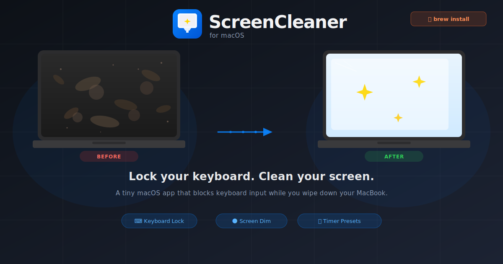

<p align="center">
  
</p>

<p align="center">
  <a href="README.md">English</a> &nbsp;|&nbsp; <b>한국어</b> &nbsp;|&nbsp; <a href="README.ja.md">日本語</a> &nbsp;|&nbsp; <a href="README.zh.md">简体中文</a>
</p>

<br/>

# ScreenCleaner

> *솔직히, 맥북 화면 더럽잖아요. 천 집어들면 손이 키보드 스쳐서 탭 날아가고, 파일 이름은 "ㄱㄱㄱㄱ"이 되고, 유튜브가 갑자기 켜지고... 결국 화면 닦다 말고 5분 수습. 화면은 여전히 더럽고요.*

---

## 이 앱을 만들게 된 이유

솔직히, 맥북 화면 더럽잖아요.

마음먹고 천 집어들면 손이 키보드를 스쳐서 탭이 날아가고, 파일 이름은 "ㄱㄱㄱㄱ"이 되고, 갑자기 유튜브 영상이 재생되고...

결국 화면 닦다 말고 5분 동안 수습.

화면은 여전히 더럽고요.

macOS에 청소 모드가 없어서 만들었습니다.

---

## 무엇을 하는 앱인가요

**ScreenCleaner**는 하나의 역할에만 집중하는 작은 macOS 메뉴 바 앱입니다: 아무 일도 일어나지 않도록 안전하게 화면을 닦을 수 있는 시간을 만들어 줍니다.

**청소 시작**을 누르면:

- **모든 키보드 입력을 시스템 수준에서 차단** — 키보드를 아무리 세게 눌러도 아무것도 눌리지 않습니다
- **화면을 검게 어둡게** 만들어 얼룩과 자국이 잘 보이게 합니다
- **타이머 카운트다운** (1, 3, 5, 10분 또는 사용자 지정)으로 청소 시간을 관리합니다

타이머가 끝나면 모든 것이 원래대로 돌아옵니다. 깨끗한 화면, 아무 혼란 없이.

---

## 설치 방법

### Homebrew (권장)

```bash
brew tap Mineru98/tap
brew install --cask screen-cleaner
```

### 수동 설치

1. [Releases](https://github.com/Mineru98/screen-cleaner-releases/releases)에서 최신 `.dmg` 파일 다운로드
2. `.dmg`를 열고 **ScreenCleaner.app**을 `/Applications`으로 드래그
3. 앱을 실행하고 안내에 따라 **손쉬운 사용** 권한 허용

---

## 요구 사항

| | |
|---|---|
| **macOS** | 14 Sonoma 이상 |
| **권한** | 손쉬운 사용 (키보드 차단을 위해 필요) |
| **아키텍처** | Apple Silicon 및 Intel |

---

## 사용 방법

1. 애플리케이션 또는 메뉴 바에서 **ScreenCleaner** 실행
2. 첫 실행 시 **손쉬운 사용** 권한 허용
3. 타이머 프리셋 선택 — **1 / 3 / 5 / 10분** — 또는 직접 시간 입력
4. **청소 시작** 클릭
5. 자유롭게 화면 닦기
6. 타이머가 끝나면 자동으로 모든 것이 복원됩니다

### 청소 중 사용 가능한 키

청소 모드에서는 아래 3가지 키만 동작합니다. 나머지는 전부 차단됩니다.

| 키 | 동작 |
|----|------|
| `F1` | 화면 밝기 낮추기 |
| `F2` | 화면 밝기 높이기 |
| `ESC` (5초 꾸욱) | 청소 취소 후 원상 복구 |

> ESC를 한 번 탁 누르면 아무 일도 없습니다. 5초 동안 꾹 눌러야 종료됩니다.

---

## 기능

- `CGEventTap`을 통한 시스템 수준 키보드 차단 — 어떤 입력도 통과하지 않습니다
- 청소 중 얼룩이 잘 보이도록 검은 오버레이로 화면 어둡게 처리
- 크래시 안전: 앱이 예기치 않게 종료되어도 밝기가 자동으로 복원됩니다
- 미니멀한 UI — 타이머와 버튼만 있는 간결한 화면
- 메뉴 바에 상주하여 필요할 때만 눈에 띕니다

---

## 소스 코드

전체 소스는 [Mineru98/screen-cleaner](https://github.com/Mineru98/screen-cleaner)에서 관리됩니다.

---

## 라이선스

[MIT](https://github.com/Mineru98/screen-cleaner/blob/main/LICENSE)
